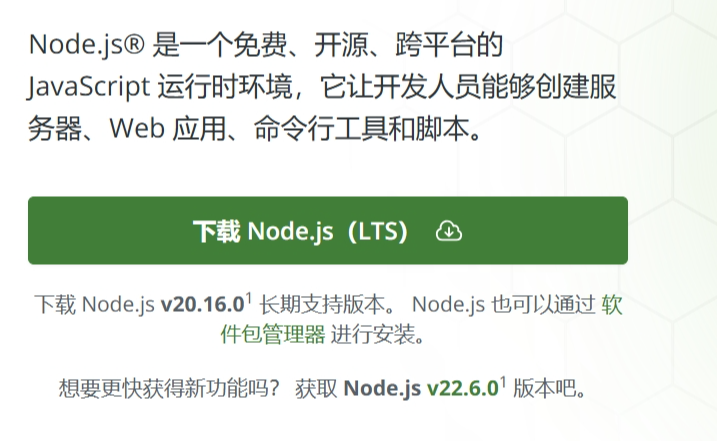

# Vue相关
Vue (发音为 /vjuː/，类似 view) 是一款用于构建用户界面的 JavaScript 框架。它基于标准 HTML、CSS 和 JavaScript 构建，并提供了一套声明式的、组件化的编程模型，帮助你高效地开发用户界面。无论是简单还是复杂的界面，Vue 都可以胜任。

# 创建第一个Vue应用
前提条件

熟悉命令行
已安装 18.3 或更高版本的 Node.js

